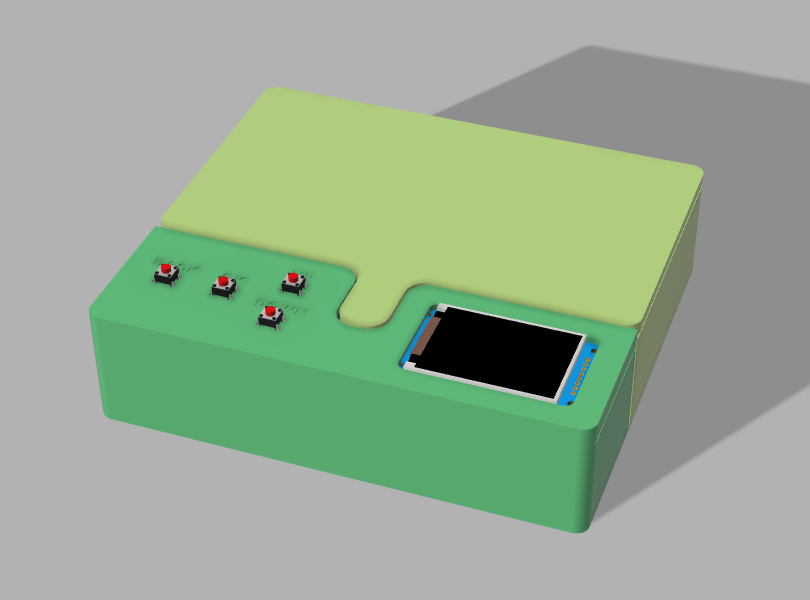
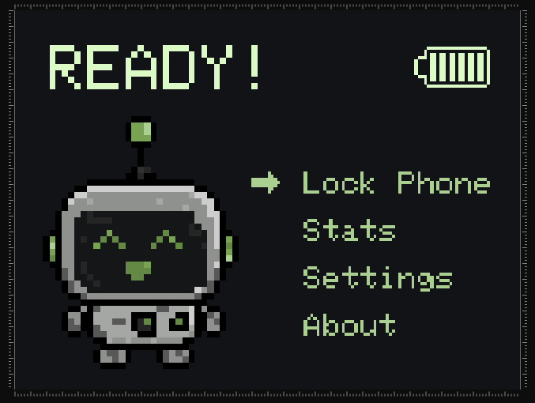
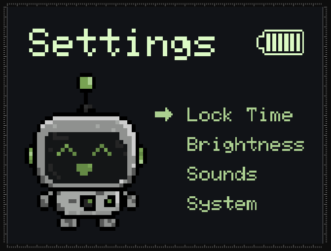
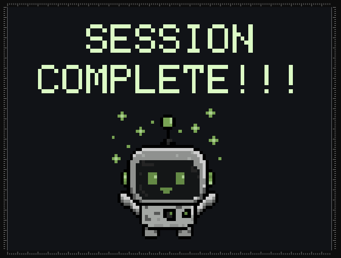
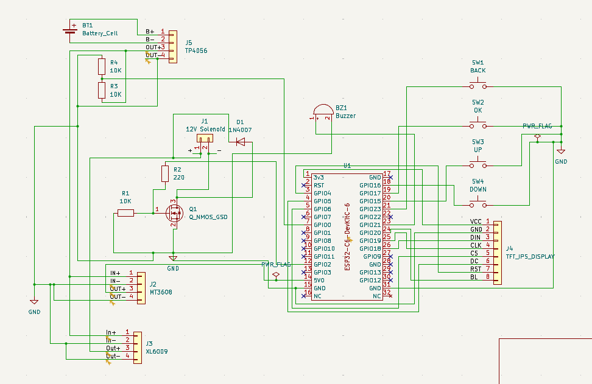

# Tamagotchi Style Phone Lockbox

This is my custom phone lockbox that turns putting your phone away into a little game. All you have to do is put your phone inside, choose for how long you want to lock your phone, and let Byte (the tamagotchi character), keep you company while you stay off your phone.



## Features

* Phone locking for specific amount of time
* Tamagotchi character (Byte)
* Button-controlled UI
* 2" 240×320 SPI TFT IPS screen
* Adjustable lock time
* Adjustable screen brightness
* Battery indicator
* Locking mechanism controlled by solenoid lock

## Interface

The UI is designed with simple menus so it can be navigated using only four buttons (okay, back, up, down). The Home screen uses this layout:

* **Lock Phone**
* **Stats**
* **Settings**
* **About**



The Settings menu currently contains:

* **Lock Time**
* **Brightness**
* **Sounds**
* **System**



I've designed seperate sprites for Byte, including idle, happy, celebrating, excited, sad, thinking and sleeping, which change according to your actions.



## How It Works

The lockbox is controlled by an **ESP32-C6-DevKitC-1**. The display show the current screen and whether Byte's happy, sad, excited, etc.. You can control the UI using the 4 physical pushbuttons, which are left from the screen.

When you press "Lock Phone", the lock mechanism starts. First of all, the lipo battrey's current passed through a step=up converter and then activates the solenoid, which unlocks the box. From that time you have 5 seconds to put your phone inside. After that, the solenoid locks, locking yyour phone inside, and Byte's animation changes accordingly.

## Hardware

The current hardware includes the following components:

* ESP32
* Waveshare 2" 240×320 SPI TFT IPS IPS LCD
* 4× pushbuttons
* 12V solenoid lock
* 2000mAh 3.7V LiPo battery
* TP4056 Battery Charging module
* 2x DC-DC boost converter
* 1A 1000V 1N4007 Diode
* Mosfet IRLB8743P N-Channel 150A

## Schematic & Hardware Wiring

The lockbox uses an ESP32-C6 with two parallel step-up converters, which are powered by a 3.7V LiPo cell managed by a TP4056 charging module.

### Power Distribution
* LiPo Battery (3.7V): Connects to TP4056 B+ / B-.
* 3.7V Rail (TP4056 OUT+): Sends input to both boost converters and the voltage divider, which is used to be able to calculate the battery's percentage..
* MT3608 Boost (5V Output): Gives power the ESP32-C6 using the 5V0 pin.
* XL6009 Boost (12V Output): Supplies high voltage to the solenoid lock and also the 1N4007 flyback diode.
* Common Ground (OUT-): All module grounds, MOSFET source, and button rails are connected to the same GND.



## Project Structure

```text
Phone-Lockbox/
├── buttons.cpp
├── buttons.h
├── globals.cpp
├── globals.h
├── graphics.cpp
├── graphics.h
├── hardware.cpp
├── hardware.h
├── home.cpp
├── home.h
├── lock.cpp
├── lock.h
├── main.ino
├── settings.cpp
├── settings.h
├── stats.cpp
├── stats.h
├── ui.cpp
└── ui.h
```
I've split the many screens and functions into different files so it's easier to navigate and can be more easily debugged.

## Current Status

The project is still in the making process.

What I've done so far:

*  Basic TFT IPS interface
*  Home screen
*  Menu navigation
*  Settings screen
*  Lock time adjustment
*  Brightness adjustment
*  Byte animations
*  Solenoid control
*  Actual countdown timer
*  Complete Stats screen
*  Sounds
*  System settings
*  Battery monitoring
*  Complete lock/unlock logic
*  Final enclosure design

I have left to do:

* Getting the parts
* Final hardware assembly

## Design

The lockbox was designed around my **iPhone 13**, with the inside dimensions, and electronics compartment built around it. The box's inside measures to 91.5 mm × 166.7 mm. While phones with about the same dimensions to the iPhone 13 can also fit, it is not guaranteed.

The UI uses pixel-art inspired by tamagotchis.


Byte was designed by hand for this project using Piskel (an online tool), with different expressions that match what you do (e.g. put your phone away = happy, completed a session = celebrating, took it out too early = sad, etc.).

## Built With

* Arduino (C++)
* ESP32
* TFT_eSPI (Arduino Library)
* Fusion
* Piskel
* lopaka.app
* 3D printing

## AI Usage

I used AI, mainly for:

- Code debugging: fixing errors and debugging.
- Code structure: help split the code into separate files.
- Byte: generating an first prototype for how Byte would look, which I then recreated and edited myself in Piskel.

The actual project design, assembly, UI, gpraphics, and final code were done by me.

---
**Made by Harry Fanouriakis**
